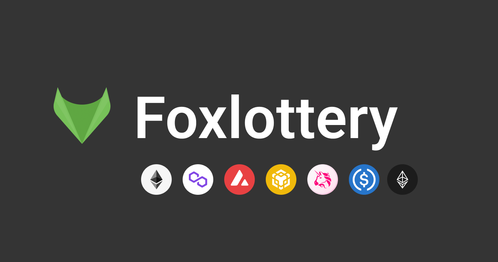

# Foxlottery

# Overview
FoxLottery is a SaaS that can provide blockchain lotteries using crypto assets and smart contracts.

It is intended to be used by municipalities around the world when they conduct lotteries.

You can set the lottery return rate, the ERC20 tokens to be used as criteria, and the lottery cycle to start the lottery immediately.

The ERC20 tokens collected from users are distributed to random winners.

The winner is determined using Chainlink VRF, which generates random numbers on the blockchain.

https://docs.chain.link/docs/chainlink-vrf/

# Vision
### Decentralized lotteries make society better.

Lotteries on the blockchain would allow even countries with less trustworthy governments to run lotteries and increase tax revenues through lotteries, because the software is fraud-proof, even if the lottery participants do not trust the lottery management.

# Advantages of decentralized lotteries
#### Guarantee of randomness of winners

Until now, the public would have trusted the government to randomly guess the winner of the lottery, but with blockchain, the public can more easily participate in the lottery by trusting the system without having to trust the government.

#### Highly secure
The speed at which bugs are found is faster when you have an open source blockchain lottery, and it is harder to hack because of the blockchain.

#### Traceability of funds
You can see how much you have transferred to which address.

#### Open source
By making it open source, governments around the world can use the same lottery system worldwide without having to develop their own online lottery systems. If there is a need for a feature, some country adds it and it is shared with the rest of the world so that if they want to use that feature, it is immediately available.

# Difference between online lotteries and decentralized lotteries

| | Distributed Lottery | Online Lottery |
| ---- | ---- | ---- |
| Source Code | Open | Closed |
| Payment Method | ERC20 Token | Credit Card, Direct Deposit |
| UI | new, easy to use | old, difficult to use |
| how winners are determined | Random Number Generation on the Blockchain | Random Number Generation on the Server |
| Security | high | normal |
| Sales Channels | web, apps, metaverse | web |
| DDoS Attack Resistance | Yes | No |
| Privacy | Yes | No |
| Login Methods | Crypto Currency Wallet (e.g. metamask) | Email Address, Phone Number |

# How to use the lottery participants
Obtain ERC20 tokens from an exchange or DeFi.

Access the lottery site, log in with a wallet service such as metamask, and purchase a ticket.

Once you have purchased your ticket, you will be shown how likely it is that you will win the lottery.

On the day of the lottery, a winner will be chosen at random and the money will be automatically transferred to the winner.

The money will be sent to the organization that will use the money to support the charitable activities determined by the votes.

# Market Size
# Lottery
Japan: 786.6 billion yen FY2018
Cited from: https://www.soumu.go.jp/main_content/000583736.pdf

World: $200 billion

The global lottery market size will increase by US$19.414 billion from 2020 to 2025.

Quote: https://www.prnewswire.com/news-releases/lottery-market-size-to-grow-by-usd-194-14-bn--38-of-the-growth-from-apac--17-000-technavio-reports-301501174.html

## Crypto Currency
The top 5 market caps added together are over $100 trillion.
It is expected to continue to grow.

## Technical specifications
## Tools used
Solidity

Hardhat

Alchemy/Infura

React/Next.js

## Blockchain Network
Developed in Solidity, can be used with Ethereum, Binance, Polygon, Avalanche, etc.

## Mechanism to ensure randomness of winnings
Chainlink VRF can be used to get random numbers that can be verified on the blockchain.
https://docs.chain.link/docs/chainlink-vrf/

Chainlink VRF has been used in PancakeSwap, PoolTogether, etc.

### PancakeSwap
Lottery operated by DeFi on the Binance smart chain
https://pancakeswap.finance/lottery

### PoolTogether
Loss-free lottery, DeFi pools profits and distributes them to pooled users by lottery.
https://PoolTogether.com/

