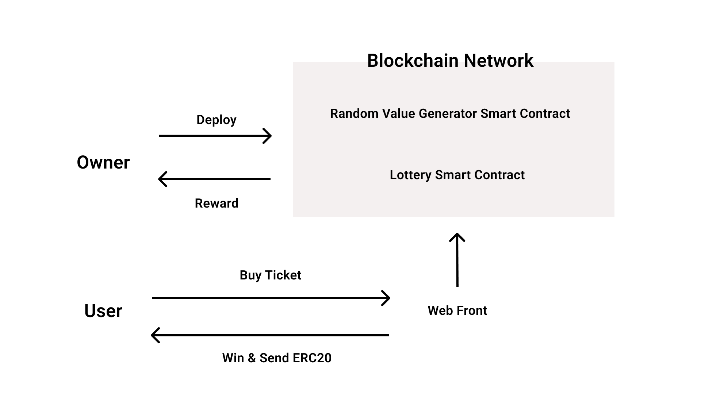

# Foxlottery

# Overview
FoxLottery is a blockchain lottery using crypto assets and smart contracts.

It is intended for use by municipalities that conduct lotteries around the world.

You can start a lottery immediately by setting the lottery return rate, the ERC20 tokens to be used as criteria, and the lottery cycle.

The ERC20 tokens collected from users will be distributed to random winners.

The winner is determined using Chainlink VRF, which generates random numbers on the blockchain.
https://docs.chain.link/docs/chainlink-vrf/

# Vision.
### Decentralized lotteries improve society

# Benefits of decentralized lotteries
#### Guarantee of randomness of winners

Until now, the public has had to trust the government to trust the lottery winners to make random decisions about who wins the lottery.
Blockchain makes it easier for the public to participate in the lottery by trusting the system without having to trust the government.

#### Highly secure
The speed at which bugs are found is faster when you have an open source blockchain lottery, and the blockchain makes it harder to hack.

#### Traceability of funds
You can see how much you have transferred to which address.

#### Open source
By making it open source, governments around the world can use the same lottery system worldwide without having to develop their own online lottery systems. If there is a need for a feature, some country will add the feature and it will be shared with the rest of the world so that if they want to use that feature, they can use it immediately.

#### Lower Operating Costs
The average cost of developing a system and printing tickets to run a lottery is 10% of the cost of running a lottery, but by doing a lottery on the blockchain, it can be reduced to almost 0%.

# Difference between online lotteries and decentralized lotteries

| | Decentralized Lottery | Online Lottery |
| ---- | ---- | ---- |
| Source Code | Open | Closed |
| Method of payment | ERC20 Token | Credit Card, Direct Deposit |
| How to determine the winner | Random number generation on the blockchain | Random number generation on the server
| Security Cost | Low | High |
| security cost | low | high |
| Sales Channels | web, apps, metaverse | web |
| security cost | low | high |
| Security Cost | Low | High |
| DDoS Attack Resistance | Yes | No |
| Privacy | Yes | No |
| login method | Crypto Currency wallet (e.g. metamask) | email address, phone number |

# Roadmap
2022 July Launch on testnet

Aug. 2022 Propose lottery smart contract to EIP, Start experimenting with retweet project on twitter

2022 Sep Propose introduction to governments and municipalities

2024 If multiple governments and municipalities introduce it, establish a world wide lottery foundation and jointly conduct a lottery

# History of lotteries
The oldest lottery in history is said to be the "White Pigeon Ballot" conducted in 206 B.C. in China during the Han Dynasty by a man named Zhang Liang, who served as Liu Bang's military commander. The reason for implementing this lottery was to secure financial resources to build the Great Wall of China.

In Europe, during the Roman Empire, churches played lotteries to raise funds for construction.

In Japan, temples used lotteries to raise funds during the Edo period.

However, because there were many cases in Japan and the U.S. where the operating bodies of lotteries were often found to be corrupt, leading to riots, lotteries were banned by law around 1900, and the government became the operating body and started playing lotteries to secure tax revenues.

# Why are lotteries prohibited by law?
This is because private sector lotteries are subject to fraud.

With blockchain technology, no cheating can occur, so in the long run, I believe that lotteries will move in the direction where private companies can use blockchain to conduct lotteries.

# Examples of Lottery Fraud
Serbia's state-run lottery company cheated

 [https://www.independent.co.uk/news/world/europe/serbian-lottery-probe-after-winning-number-called-before-its-drawn-10430922.html](https://www.independent.co.uk/news/world/europe/serbian-lottery-probe-after-winning-number-called-before-its-drawn-10430922.html)

Public lottery proceeds misappropriated in China.

[https://www.nikkei.com/article/DGKKASGM08H2T_Z20C15A7EAF000/](https://www.nikkei.com/article/DGKKASGM08H2T_Z20C15A7EAF000/)

Lottery operator's employees fraudulent

 [https://www.desmoinesregister.com/story/news/investigations/2017/08/22/iowa-lottery-cheat-sentenced-25-years/566642001/](https://www.desmoinesregister.com/story/news/investigations/2017/08/22/iowa-lottery-cheat-sentenced-25-years/566642001/)

# web3 Lottery participant usage
Obtain an ERC20 token from an exchange or DeFi.

Access the lottery website, log in with a wallet service such as metamask, and purchase a ticket.

Once you have purchased your ticket, you will be shown how likely it is that you will win the lottery.

On the day of the lottery, a winner will be chosen at random and the money will be automatically transferred to the winner.

The money will be sent to the organization that will use the money to support the charitable activities determined by the votes.

# Market Size
# Lottery
Japan: 786.6 billion yen FY2018

Cited from: https://www.soumu.go.jp/main_content/000583736.pdf

World: $200 billion

The global lottery market size will increase by US$19.414 billion from 2020 to 2025.

Quote: https://www.prnewswire.com/news-releases/lottery-market-size-to-grow-by-usd-194-14-bn--38-of-the-growth-from-apac--17-000-technavio-reports-301501174.html

## Crypto Currency
The top 5 market caps added together are over $100 trillion.
It is expected to continue to grow.

## Technical specifications
## Tools used
Solidity

Hardhat

Alchemy/Infura

React/Next.js

## Blockchain Network
Developed in Solidity, can be used with Ethereum, Binance, Polygon, Avalanche, etc.

## Mechanism to ensure randomness of winnings
Chainlink VRF can be used to get random numbers that can be verified on the blockchain.

https://docs.chain.link/docs/chainlink-vrf/

Chainlink VRF has been used in PancakeSwap, PoolTogether, etc.

### PancakeSwap
Lottery operated by DeFi on the Binance smart chain

https://pancakeswap.finance/lottery

### PoolTogether
Loss-free lottery, DeFi pools profits and distributes them to pooled users by lottery.

https://PoolTogether.com/

# Web3Lottery Architecture.

# Github Repo

#### foxlottery-interface

Web front for playing the lottery 

https://github.com/Foxlottery/foxlottery-interface

#### foxlottery-v1

BlockChain Smart Contract for playing the lottery 

https://github.com/Foxlottery/foxlottery-v1