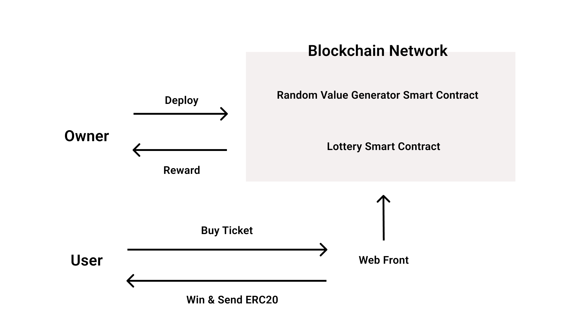

# Foxlottery

# 概要
FoxLotteryは暗号資産とスマートコントラクトを使用したブロックチェーン宝くじです。

世界中の宝くじをする自治体が、使用することを想定しています。

宝くじの還元率や基準にするERC20トークン、宝くじのサイクルを設定して、すぐに宝くじを始めることができます。

ユーザーから収集したERC20トークンをランダムな当せん者に分配します。

当せん者の決定はChainlink VRFを使い、ブロックチェーン上で乱数を生成します。
https://docs.chain.link/docs/chainlink-vrf/

# ビジョン
### 分散型宝くじで社会をより良くする

# 分散型宝くじのメリット
#### 当せん者のランダム性の担保

これまでは国民が政府を信用して宝くじの当せん者をランダムで当選者の決定をしていると信用していましたが、
ブロックチェーンを使えば、政府を信用しなくても、システムを信用することで、国民がより宝くじに参加しやすくなります。

#### セキュリティが高い
オープンソースでブロックチェーン宝くじをしているとバグの見つかる速度が速く、ブロックチェーンを使っているので、ハッキングが起きづらい。

#### 資金の追跡可能性
どのアドレスにどれくらいの量を送金したのか、見ることができます。

#### オープンソース
オープンソースにすることで世界各国の政府が独自でオンライン宝くじのシステムを開発しなくても、世界中で同じ宝くじのシステムを使えます。ニーズがある機能があれば、どこかの国が機能追加して、それは世界各国に共有され、その機能を使いたい場合、すぐに使えるようにします。

#### 運営コストの低下
宝くじを運営するためにシステムの開発、チケットの印刷をする費用が平均10%かかっていますが、ブロックチェーンで宝くじをすることでほぼ0%にできます。

# オンライン宝くじと、分散型宝くじの違い

|    |  分散型宝くじ  |  オンライン宝くじ  |
| ---- | ---- | ---- |
|  ソースコード  |  オープン  |  クローズド |
|  決済手段  |  ERC20 トークン  | クレジットカード、口座振込 |
|  当選者の決定方法  |  ブロックチェーン上の乱数生成  | サーバー上の乱数生成 |
|  セキュリティ  | 高い | 普通 |
| セキュリティコスト | 低い | 高い |
|  販売チャネル  |  web, アプリ、メタバース  | web |
|  資金の追跡可能性  | ある | ない |
|  参加者が運営を信用する必要性  | ない | ある |
| DDos攻撃耐性 | ある | ない |
| プライバシー | ある | ない |
| ログイン方法 | 仮想通貨ウォレット(metamaskなど) | メールアドレス、電話番号 |

# ロードマップ
2022年 7月 テストネットにローンチ

2022年 8月 lottery smart contractをEIPに提案, twitterでリツイート企画で実験を開始

2022年 9月 各国政府、自治体に導入を提案

2024年 複数の政府、自治体が導入したら、world wide lottery財団を設立して、共同で宝くじをする

# 宝くじの歴史
歴史上最古の宝くじは、紀元前206年、漢の時代の中国で、劉邦の軍師を務めた張良という人物が実施した「白鳩票」だと言われています。この宝くじを実施したのは、万里の長城を建設する財源確保のためだったそうです。

ヨーロッパではローマ帝国時代に教会が、建設費用調達のために宝くじをしていました。

日本では江戸時代に、お寺が資金調達のために宝くじを利用していました。

しかし、宝くじは運営母体に不正が多く出てしまい、暴動になる事件が、日本やアメリカで発生したため、1900年前後に宝くじは法律で禁止されるようになり、政府が運営母体となり税収を確保するために宝くじをするようになりました。

# 宝くじがなぜ法律で禁止されているのか？
民間で宝くじをすると不正が起きるためです。

ブロックチェーン技術を使えば、八百長は起きないので、長期的には、宝くじはブロックチェーンを使えば民間企業が行ってもよい方向に向かうと思います。

# 宝くじの不正の事例
セルビアの国営宝くじ会社が不正

[https://www.independent.co.uk/news/world/europe/serbian-lottery-probe-after-winning-number-called-before-its-drawn-10430922.html](https://www.independent.co.uk/news/world/europe/serbian-lottery-probe-after-winning-number-called-before-its-drawn-10430922.html)

中国で公営宝くじの収益が不正に流用される

[https://www.nikkei.com/article/DGKKASGM08H2T_Z20C15A7EAF000/](https://www.nikkei.com/article/DGKKASGM08H2T_Z20C15A7EAF000/)

宝くじ運営会社の職員が不正

[https://www.desmoinesregister.com/story/news/investigations/2017/08/22/iowa-lottery-cheat-sentenced-25-years/566642001/](https://www.desmoinesregister.com/story/news/investigations/2017/08/22/iowa-lottery-cheat-sentenced-25-years/566642001/)

# web3宝くじ参加者の使い方
取引所やDeFiでERC20トークンを入手する。

宝くじのサイトにアクセスして、metamaskなどのウォレットサービスでログインして、チケットを購入する。

チケットを購入したら、どれくらいの確率で、当せんするのか表示されます。

当せん日になったらランダムで当せん者が選ばれて、当せん者に自動で送金が行われます。

投票によって決まったチャリティ活動を使う団体に送金が行われます。

# 市場規模
## 宝くじ
日本: 7,866億円 2018年度

引用元: https://www.soumu.go.jp/main_content/000583736.pdf

世界: 2000億ドル

世界の宝くじの市場規模は2020年から2025年まで、194.14億米ドル増加する。

引用元: https://www.prnewswire.com/news-releases/lottery-market-size-to-grow-by-usd-194-14-bn--38-of-the-growth-from-apac--17-000-technavio-reports-301501174.html

## 仮想通貨
時価総額トップ5を足しただけで、100兆円を超えています。
今後も成長する見込みです。

# 技術仕様について
## 使用ツール
Solidity

Hardhat

Alchemy/Infura

React/Next.js

## ブロックチェーンネットワーク
Solidityで開発しているので、Ethereum、Binance、Polygon, Avalancheなどで使用可能です。

## 当せんのランダム性を担保する仕組み
Chainlink VRFを使用するとブロックチェーン上で検証可能なランダムな数字を取得できます。

https://docs.chain.link/docs/chainlink-vrf/

Chainlink VRFはPancakeSwapやPoolTogetherなどの利用実績があります。

### PancakeSwap
バイナンススマートチェーン上のDeFiが運営している宝くじ

https://pancakeswap.finance/lottery

### PoolTogether
損失の出ない宝くじ、DeFiプールして得た利益をプールしたユーザーに抽選で分配する

https://PoolTogether.com/

# Web3Lottery アーキテクチャ

# Github リポジトリ

#### foxlottery-interface

宝くじをするためのwebフロントエンド

https://github.com/Foxlottery/foxlottery-interface

#### foxlottery-v1

宝くじをするためのブロックチェーンスマートコントラクト

https://github.com/Foxlottery/foxlottery-v1
